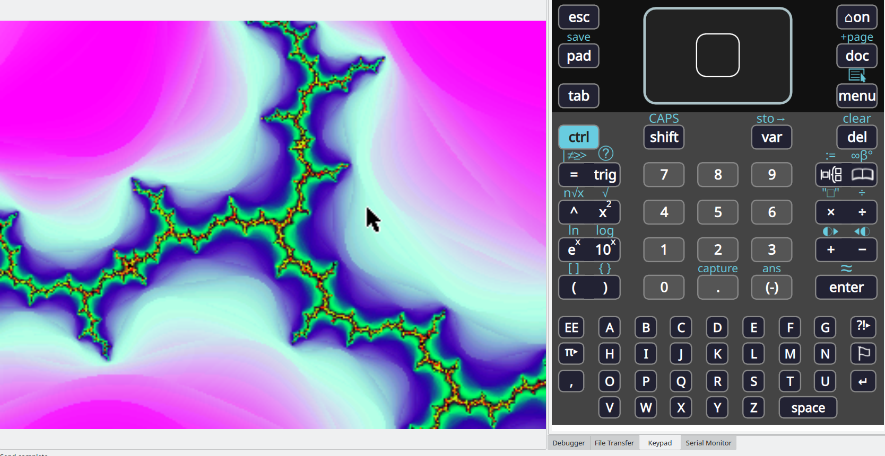

# SDL-Mandelbrot ported to the TI-Nspire

This is an implementation of the Mandelbrot Set fractal in C, using the SDL
graphics library.

It's an efficient implementation along with a user interaction by the keyboard
allowing zooming and moving throughout the set.

To build just run `make` and it should do the job. The prerequisites are a
working NDless environment with a recent SDL development library. I retrieved
the changes by hexane360 to the nSDL and the mouse pointer is working fine.

To know more about the Mandelbrot Set please check the [Wikipedia
Article](http://en.wikipedia.org/wiki/Mandelbrot_Set)

